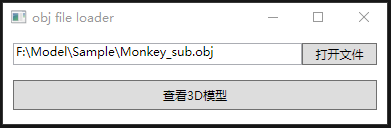

# Obj File 3D Viewer

受Skechfab的网页3D查看器启发，想着自己试试写一个3d模型查看器。正好最近正在学习OpenGL，写了一个练习一下。

本项目只是作为学习OpenGL过程中的一个练习，有关C++和GLSL的绝大部分代码都参考自[LearnOpenGL](https://learnopengl.com/)，受益良多。

### 环境

Windows 10 x64

.NET Core 3.1

OpenGL Version 3.3

### 引用

glad：https://glad.dav1d.de/

GLFW：https://github.com/glfw/glfw

stb_image.h：https://github.com/nothings/stb/blob/master/stb_image.h

assimp：https://github.com/assimp/assimp

---

### 功能

- 视图：支持Orbit Turntable模式和Fly Navigation模式
- 着色：正常模式、MatCap模式、线框模式（能显示四边形和多边形）

### 按键说明

**Orbit模式:**

`鼠标左键`：以物体为中心旋转视角

`鼠标中键`：平移视角

`鼠标中键滑动`：拉近或拉远镜头

**Fly Navigation模式**

`鼠标右键按住`：进入Fly Navigation模式

`鼠标中键滑动`：调整相机焦距

`W`：前进

`S`：后退

`A`：左移

`D`：右移

`Q`：上升

`E`：下降

**切换着色**

`1`：正常模式

`2`：MatCap模式

`3`：线框模式

---

### 展示

---

#### 已知Bug

不支持.obj文件所在路径中有中文（可能是assimp在加载模型的时候不支持中文路径）
